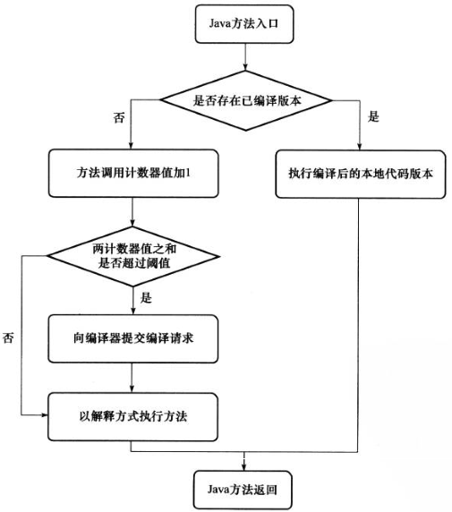
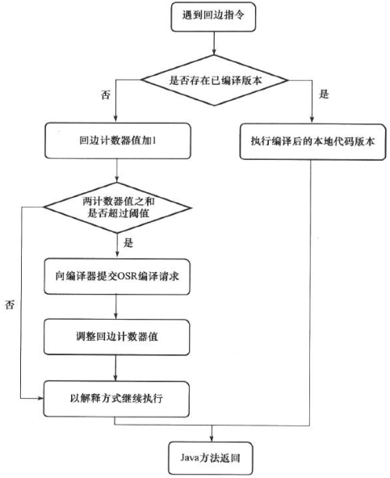
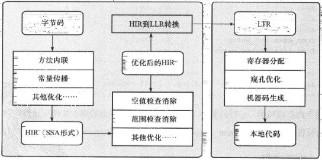

#晚期（运行期）优化

##概述

在部分的商用虚拟机中，java程序最初是通过**解释器**（Interpreter）进行**解释执行**的，当虚拟机发现某个方法或代码块的运行特别频繁时，就会把这些代码认定为“**热点代码**”（Hot Spot Code）。为了提高热点代码的执行效率，在运行时，虚拟机将会把这些代码**编译**成与本地平台相关的机器码，并进行各种层次的优化，完成这个过程的编译器称为**即时编译器**（Just In Time Compiler）

java虚拟机规范中没有规定即时编译器应该如何实现，也没有规定虚拟机必需拥有即时编译器，这部分功能完全是虚拟机具体实现相关的内容。本文中提及的编译器、即时编译器都是指**HotSpot虚拟机**内的即时编译器

##HotSpot虚拟机内的即时编译器

####解释器和编译器

HotSpot虚拟机采用**解释器与编译器并存**的架构，解释器与编译器两者各有优势：

1. 当程序需要迅速启动和执行的时候，解释器可以首先发挥作用，省去编译的时间，**立即执行**
2. 在程序运行后，随着时间的推移，编译器逐渐发挥作用，把越来越多的代码编译成本地代码之后，可以**获得更高的执行效率**
3. 当程序运行环境中内存资源限制较大，可以使用**解释**执行**节约内存**，反之可以使用**编译**执行来**提升效率**
4. 解释器还可以作为编译器**激进优化**的一个“**逃生门**”，让编译器根据概率选择一些大多数时候都能提升运行速度的优化手段，当激进优化的假设不成立时，可以通过逆优化退回到解释状态继续执行


HotSpot虚拟机中内置了两个即时编译器，分别称为Client Compiler和Server Compiler，或者简称为**C1编译器**和**C2编译器**，虚拟机默认采用解释器与其中一个编译器直接配合的方式工作

由于即时编译器编译本地代码需要占用程序运行时间，要编译出优化程度更高的代码，所花费的时间可能更长；而且想要编译出优化程度更高的代码，解释器可能还要替编译器收集性能监控信息，这对解释执行的速度也有影响。HotSpot虚拟机采用**分层编译**（Tiered Compilation）的策略，其中包括：

* **第0层**：程序**解释执行**，解释器不开启性能监控功能（Profiling），可触发第1层编译
* **第1层**：也称为**C1编译**，将字节码编译为本地代码，进行简单、可靠的优化，如有必要将加入性能监控的逻辑
* **第2层**：也称为**C2编译**，也是将字节码编译为本地代码，但是会启用一些编译耗时较长的优化，甚至会根据性能监控信息进行一些不可靠的激进优化

####编译对象与触发条件

在运行过程中会被即时编译器编译的“**热点代码**”有两类：

* 被多次调用的方法
* 被多次执行的循环体

在这两种情况下，都是**以整个方法作为编译对象**，这种编译方式被称为**栈上替换**（On Stack Replacement，简称OSR编译，即方法栈帧还在栈上，方法就被替换了）

判断一段代码是不是热点代码，是不是需要触发即时编译，这样的行为称为**热点探测**（Hot Spot Detection），目前主要的热点探测判定方式有两种：

* **基于采样的热点探测**（Sample Based Hot Spot Detection）：采用这种方法的虚拟机会周期性地检查各个线程地栈顶，如果发现某个方法**经常出现在栈顶**，那这个方法就是“热点方法”
  * **优点**：实现简单、高效，还可以很容易地获取方法调用关系
  * **缺点**：很难精确地确认一个方法的热度，容易因为受到线程阻塞或别的外界因素的影响而扰乱热点探测
* **基于计数器的热点探测**（Counter Based Hot Spot Detection）：采用这个种方法的虚拟机会为每个方法建立计数器，**统计方法的执行次数**，如果执行次数超过一定的阈值就认为它是“热点方法”
  * **优点**：统计结果相对来说更加精确和严谨
  * **缺点**：实现复杂

在**HotSpot虚拟机**中使用的是**第二种**，因此它为每个方法准备了两类计数器：**方法调用计数器**（Invocation Counter）和**回边计数器**（Back Edge Counter）。在确定虚拟机运行参数的前提下，这两个计数器都由一个确定的阈值，当计数器超过阈值溢出了，就会触发JIT编译

* **方法调用计数器**：用于统计方法被调用的次数，它的默认阈值在Client模式下是1500次，在Server模式在是10000次，可通过-XX: CompileThreshold来设定
  * 方法被调用时，先检查该方法是否存在被JIT编译过的版本
    * **存在**：优先使用编译后的本地代码来执行
    * **不存在**：将此方法的调用计数器值加1，执行下一步
  * 判断方法调用计数器与汇编计数器值之和是否超过方法调用计数器的阈值
    * **超过阈值**：向即时编译器提交一个该方法的代码编译请求。默认不会同步等待编译请求完成，而是继续解释执行，当编译工作完成之后，这个方法的调用入口地址就会被系统自动改写成新的，下一次调用该方法时就会使用已编译版本
    * **未超过**：解释执行
  * 如果不做任何设置，方法调用计数器统计的**不是方法被调用的绝对次数**，**而是一个相对执行频率**，即一段时间之内方法被调用的次数。当超过一定的时间限度，如果方法的调用次数仍然不足以让它提交给即时编译器编译，那这个方法的调用计数器就会被减少一般，这个过程称为方法调用计数器的**热度衰减**（Counter Decay）



* **回边计数器**：用于统计一个方法中循环体代码执行的次数，在字节码中遇到控制流向后跳转的指令称为“回边”（Back Edge）
  * 回边计数器阈值计算公式：
    * **Client模式**：方法调用计数器阈值（CompileThreshold） * OSR比率（OnStackReplacePercentage） / 100 ==> 默认值为13995
    * **Server模式**：方法调用计数器阈值（CompileThreshold） * (OSR比率（OnStackReplacePercentage） - 解释器监控比率（InterpreterProfilePercentage） / 100) ==> 默认值为10700
  * 当解释器遇到一条回边指令时，会先查找将要执行的代码片段是否有已经编译好的版本
    * **有**：优先执行已编译代码
    * **无**：把回边计数器的值加1，执行下一步
  * 判断方法调用计数器与回边计数器值之后是否超过回边计数器的阈值
    * **超过**：提交一个OSR编译请求，并且把回边计数器的值降低一些，以便继续在编译器中执行循环，等待编译器输出编译结果
    * **未超过**：解释执行
  * 与方法计数器不同，回边计数器**没有计数热度衰减的过程**，因此这个计数器统计的就是该方法循环执行的绝对次数



ps：上面描述的是Client VM的即时编译方法，对于Server VM来说，执行情况会比上面的描述更复杂

####编译过程

Server Compiler和Client Compiler两个编译器的编译过程是不一样的

Client Compiler是一个**简单快速的三段式编译器**，主要的关注点在于**局部性的优化**，而放弃了许多耗时较长的全局优化手段

1. **第一个阶段**：使用一个平台独立的前端将字节码构造成一种**高级中间代码**表示（High-Level Intermediate Representaion, HIR）。HIR使用静态单分配（Static Single Assignment, SSA）的形式来代表代码值，这可以使得一些在HIR的构造过程之中和之后进行的优化动作更容易实现。在此之前编译器会在字节码上完成一部分基础优化，如方法内联、常量传播等
2. **第二个阶段**：使用一个平台相关的前端从HIR中产生**低级中间代码**表示（Low-Level Intermediate Representaion, LIR），而在此之前会在HIR上完成另外一些优化，如空值检查清除、范围检查清除等
3. **最后阶段**：使用平台相关的后端使用线性扫描算法（Linear Scan Register Allocation）在LIR上分离寄存器，并在LIR上做窥孔（Peephole）优化，然后产生**机器代码**



Server Compiler是**专门面向服务端的典型应用并为服务端的性能配置特别调整过的编译器**，它会执行所有经典的优化动作。Server Compiler的寄存器分配器是一个全局图着色分配器，它可以充分利用某些处理器架构上的大寄存器集合。以即时编译的标准来看，Server Compiler**编译速度比较缓慢**，但依然远远超过传统的静态优化编译器，而且相对于Client Compiler编译**输出的代码质量有所提高**，可以减少本地代码的执行时间，从而抵消了额外的编译时间开销

##编译优化技术

在即时编译器中采用的优化技术有很多，本节主要针对以下四种优化技术：

* 语言无关的经典优化技术之一：**[公共子表达式消除](#公共子表达式消除)**
* 语言相关的经典优化技术之一：**[数组范围检查消除](##数组范围检查消除)**
* 最重要的优化技术之一：**[方法内联](#方法内联)**
* 最前沿的优化技术之一：**[逃逸分析](#逃逸分析)**

####公共子表达式消除

公共子表达式消除是一个普遍应用与各种编译器的经典优化技术，它的含义是：

* 如果一个表达式E已经计算过了，并且从先前的计算到现在E中的**所有变量的值都没有发生变化**，那么E的这次出现就成为了公共子表达式
* 对于这种表达式，没有必要花时间再对它进行计算，只需要直接**用前面计算过的表达式结果替代E**就可以了
* 如果这种优化仅限于程序的基本块内，便称为**局部公共子表达式消除**（Local Common Subexpression Elimination），如果这种优化的范围涵盖了多个基本块，那就称为**全局公共子表达式消除**（Global Common Subexpression Elimination）

####数组边界检查消除

数组边界检查消除（Array Bounds Checking Elimination）是即时编译器中的一项语言相关的经典优化技术。由于java语言中访问数组元素时，系统将会**自动进行上下界的范围检查**，这必定会**造成性能负担**。为了安全，数组边界检查是必须做的，但数组边界检查是否必须一次不漏的执行则是**可以“商量”**的事情。例如编译器通过数据流分析判定数组下标的取值永远在[0,数组.length)之内，就可以**把数组的上下界检查消除**

从更高的角度看，大量安全检查使编写java程序更简单，但也造成了更多的**隐式开销**，对于这些隐式开销，除了尽可能把运行期检查提到编译期完成的思路之外，还可以使用**隐式异常处理**：

  ```
  if(x != null){
    return x.value;
  }else{
    throw new NullPointException();
  }

  隐式异常优化后：

  try{
    return x.value;
  }catch(segment_fault){
    uncommon_trap();
  }
  ```

虚拟机会注册一个Segment Fault信号的异常处理器（uncommon_trap()），这样x不为空时，不会额外消耗一次对foo判空的开销。代价是当x为空时，必须转入异常处理器中恢复并抛出NullPointException，速度远比一次判空检查慢

####方法内联

方法内联是编译器最重要的优化手段之一，除了消除方法调用成本之外，更重要的意义是**为其他优化手段建立良好的基础**。方法内联的优化行为只不过是把目标方法的代码“**复制**”到发起调用的方法之中，**避免发生真实的方法调用**而已。但实际上java虚拟机中的内联过程远远没有那么简单，因为java中的方法大多数是**虚方法**，虚方法在编译期做内联的时候**根本无法确定**应该使用哪个方法版本

对此java虚拟机设计团队想了很多办法，首先是引入了一种名为“**类型继承关系分析**”（Class Hierarchy Analysis, CHA）的技术，这是一种基于整个应用程序的类型分析技术，它用于确定在目前已加载的类中，某个接口是否有多余一种的实现，某个类是否存在子类、子类是否为抽象类等信息

编译器在进行内联：
* **非虚方法**：直接进行内联，这时候的内联是有稳定前提保障的
* **虚方法**：向CHA查询此方法只在当前程序下是否有多个目标版本可供选择
  * **只有一个**：可以进行内联，不过这种内联属于**激进优化**，需要预留一个“**逃生门**”，称为**守护内联**（Guarded Inlining）。如果程序的后续执行过程中，虚拟机一直没有加载到会令这个方法的接收者的继承关系发生变化的类，那这个内联游湖的代码就可以一直使用下去。否则，就需要抛弃已经编译的代码，退回到解释状态执行，或者重新进行编译
  * **有多个版本**：编译器还将进行最后一次努力，使用**内联缓存**（Inline Cache）来完成方法内联。工作原理大致是：在未发生方法调用之前，内联缓存状态为空，当第一次调用发生后，**缓存记录下方法接收者的版本信息**，并且每次进行方法调用时都比较接收者版本，如果以后进来的每次调用的方法接收者版本都是一样的，那这个内联还可以一直用下去。如果发生了方法接收者不一致的情况，就说明程序真正使用了虚方法的多态特性，这时才会**取消内联**，查找虚方法表进行**方法分派**

####逃逸分析

逃逸分析（Escape Analysis）是目前java虚拟机中比较前沿的优化技术，它与类型继承关系分析一样，并**不是直接优化代码的手段，而是为其他优化手段提供依据的分析技术**。其基本行为是分析对象动态作用域：当一个对象在方法中被定义后，它可能被外部方法所引用，如作为调用参数传递到其他方法中，称为**方法逃逸**；被外部线程访问到，称为**线程逃逸**

如果能证明一个对象不会逃逸到方法或线程之外，则可能为这个变量进行一些高效的优化：

* **栈上分配**（Stack Allocation）：将对象在栈上分配内存，这样就可以使对象所占内存空间随栈帧出栈而销毁，减小垃圾收集系统的压力
* **同步消除**（Synchronization Elimination）：对象无法被其他线程访问，这个变量的读写肯定不会有竞争，对这个变量实施的同步措施也就可以消除掉
* **标量替换**（Scalar Replacement）：**标量**（Scalar）是指一个数据已经无法再分解成更小的数据来表示。如果逃逸分析证明一个对象不会被外部访问，并且这个对象可以被拆散的话，那程序真正执行的时候**可能不创建这个对象**，而直接创建它的成员变量来代替。将对象拆分后，除了可以让对象的成员变量在栈上分配和读写之外，还可以为后续进一步的优化手段创建条件

##java与C/C++的编译器对比

java与C/C++的编译器对比实际上**代表了最经典的即时编译器与静态编译器的对比**。java虚拟机的即时编译器与C/C++的静态优化编译器相比，可能会由于下列原因而导致输出的本地代码有一些劣势：

1. 即时编译器运行时**占用的是用户程序的运行时间**，因此即时编译器不敢随便引入大规模的优化技术，而编译的时间成本在静态优化编译器中并不是主要的关注点
2. java语言是动态的类型安全语言，这就意味着虚拟机**必须频繁地进行安全检查**
3. java语言中虚方法的使用频率远远大于C/C++语言，导致**即时编译器在进行一些优化时的难度要远大于C/C++的静态优化编译器**
4. java语言时可以动态扩展的语言，运行时加载新的类可能改变程序类型的继承关系，导致许多全局的优化措施都**只能以激进优化的方式来完成**
5. java虚拟机中对象的内存分配都是在堆上进行的，而C/C++的对象则有多种分配方式，而且C/C++中主要由用户程序代码来回收分配的内存，因此**运行效率上比垃圾收集机制要高**

上面说的java语言相对C/C++的劣势都是为了换取**开发效率上的优势**而付出的代价，而且还有许多优化是java的即时编译器能做而C/C++的静态优化编译器不能做或者不好做的，如别名分析、调用频率预测、分支频率预测、裁剪为被选择的分支等
