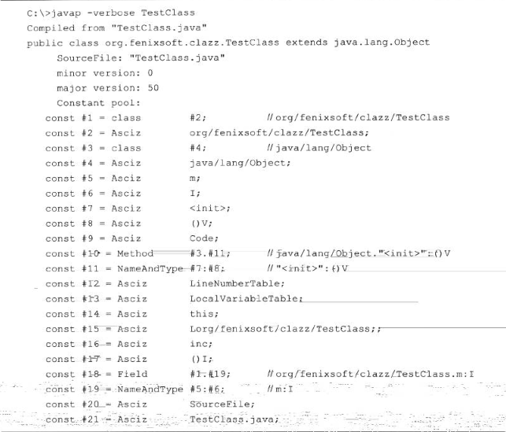

#类文件结构

Java在刚刚诞生之初曾经提出过一个非常著名的口号：“一次编译，导出执行”，将java文件编译为class文件，然后由JVM来处理平台的差异性，这个特性也使其他的语言能够在JVM上运行。

##Class类文件的结构

|占用大小|字段描述|数量|
|---|---|---|
|4bit|magic：魔数，用于标识文件类型，对于java来说是0xCAFEBABE|1|
|2bit|minor_version：次版本号|1|
|2bit|major_version：主版本号|1|
|2bit|constant_pool_count：常量池大小，从1开始而不是0。当这个值为0时，表示后面没有常量|1|
|不定|constant_pool：常量池的主体部分，主要存放两大类常量：**字面量（Literal）**和**符号引用（Symbolic References）**。字面量类似于java的常量，符号引用属于编译原理方面的概念，主要包括类和接口的权限定名（Fully Qualified Name）、字段名称和描述符（Descriptor）、方法名称和描述符 [#常量池中的14种常量项的结构总表](#常量池中的14种常量项的结构总表)|常量个数|
|u2 | access_flags | 1|
|u2 | this_class | 1|
|u2 | super_class | 1|
|u2 | interfaces_count | 1|
|u2 | interfaces | interfaces_count|
|u2 | fields_count | 1|
|field_info | fields | fields_count|
|u2 | methods_count | 1|
|method_info | methods | methods_count|
|u2 | attributes_count | 1|
|attribute_info | attrbutes | attributes_count|

####常量池中的14种常量项的结构总表

####魔数与Class文件版本

####常量池

####访问标志

####类索引、父类索引与接口索引集合

####字段表集合

####方法表集合

####属性表集合

1. Code属性
2. Exceptions属性
3. LineNumberTable属性
4. LocalVariableTable属性
5. SourceFile属性
6. ConstantValue属性
7. innerClasses属性
8. Deprecated及Synthetic属性
9. StackMapTanle属性
10. Signature属性
11. BootstrapMethods属性

##字节码指令简介

####字节码与数据类型

####加载和存储命令

####运算指令

####类型转换指令

####对象创建与访问指令

####操作数栈管理指令

####控制转移指令

####方法调用和返回指令

####异常处理指令

####同步指令

##公有设计和私有实现

##Class文件结构的发展
