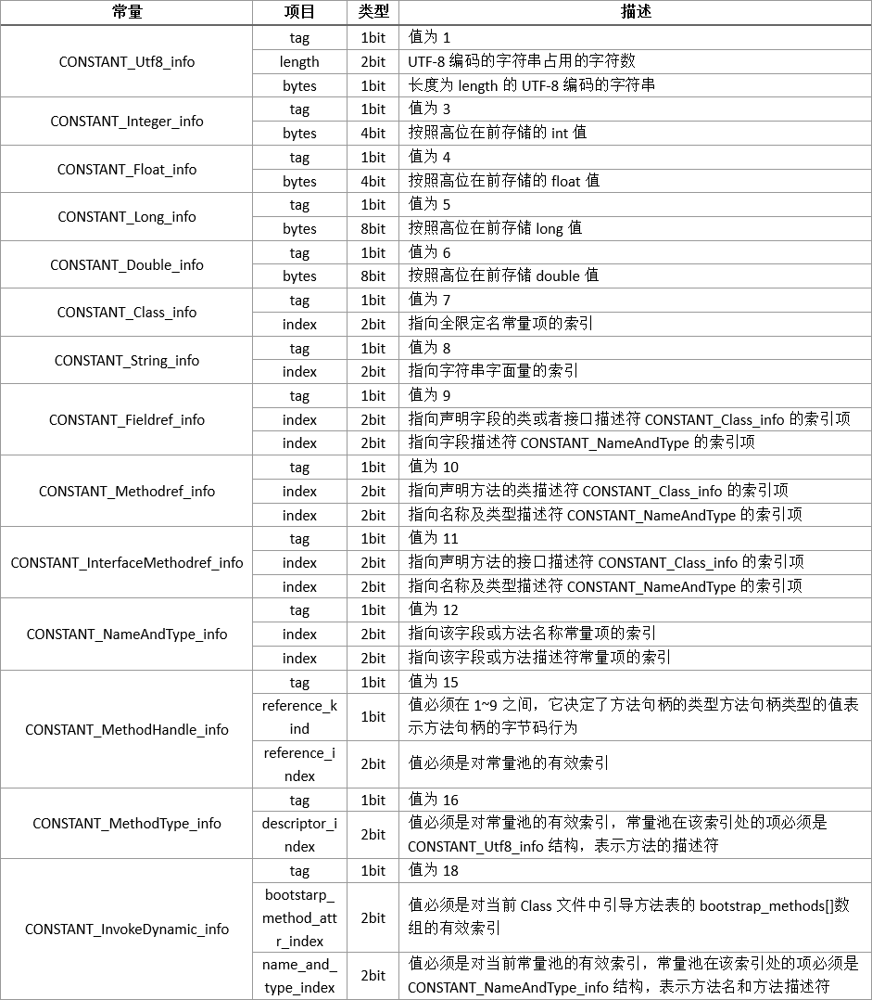

#类文件结构

Java在刚刚诞生之初曾经提出过一个非常著名的口号：“一次编译，导出执行”，将java文件编译为class文件，然后由JVM来处理平台的差异性，这个特性也使其他的语言能够在JVM上运行。

##Class类文件的结构

|占用大小|字段描述|数量|
|---|---|---|
|4bit|**magic**：魔数，用于标识文件类型，对于java来说是0xCAFEBABE|1|
|2bit|**minor_version**：次版本号|1|
|2bit|**major_version**：主版本号|1|
|2bit|**constant_pool_count**：常量池大小，从1开始而不是0。当这个值为0时，表示后面没有常量|1|
|不定|**constant_pool**：[#常量池](#常量池)|constant_pool_count-1|
|2bit|**access_flags**：访问标志，标识这个class是类还是接口、public、abstract、final等|1|
|2bit|**this_class**：类索引 [#类索引查找全限定名的过程](#类索引查找全限定名的过程)|1|
|2bit|**super_class**：父类索引|1|
|2bit|**interfaces_count**：接口计数器|1|
|每个2bit|**interfaces**：接口索引集合|interfaces_count|
|2bit|**fields_count**：字段的数量|1|
|不定|**fields**：[#字段表](#字段表)|fields_count|
|2bit|**methods_count**：方法数量|1|
|不定|**methods**：[#方法表](#方法表)|methods_count|
|2bit|**attributes_count**：属性数量|1|
|不定|**attrbutes**：[#属性表](#属性表)|attributes_count|

####常量池

主要存放两大类常量：

* **字面量（Literal）**：类似于java的常量
* **符号引用（Symbolic References）**：属于编译原理方面的概念，主要包括类和接口的权限定名（Fully Qualified Name）、字段名称和描述符（Descriptor）、方法名称和描述符。

####类索引查找全限定名的过程

####字段表

字段表集合中**不会**列出从超类或者父接口中继承而来的字段

* **access_flags**：**字段标识符**，public、private、protected、static、final、volatile、transient等
* **name_index**：字段的**简单名称**
* **descriptor_index**：字段或方法的**描述符**
* **attributes_count**：属性数量
* **attributes**：[#属性表](#属性表)

字段访问标志：

####方法表

####属性表

Class文件、字段表、方法表都可以携带自己的属性表数据集合。与Class文件中其他的数据项目要求严格不同，属性表集合的限制相对宽松。在java虚拟机规范1.7版本中定义了21项属性。

#####1. Code属性

方法体内java代码编译后生成的字节码指令存储在Code属性内，Code属性表的结构：

* **attribute_name_index**：是一项指向CONSTANT_Utf8_info型常量的索引，常量为“Code”
* **attribute_length**：属性值的长度
* **max_stack**：操作数栈（Operand Stacks）深度的最大值
* **max_locals**：局部变量表所需的存储空间
* **code_length**：字节码长度
* **code**：用于存储字节码指令的一系列字节流，每个指令就是一个1bit的单字节  一字节 => 指令 => 动作 （linux命令行、汇编）
* **exception_table_length**：异常表长度
* **exception_table**：异常表
  * **start_pc**：开始行
  * **end_pc**：结束行
  * **handler_pc**：处理异常行
  * **catch_type**：当catch_type类型或其子类型的异常发生时，转到handler_pc

#####2. Exceptions属性

Exceptions属性的作用是列举处方法中可能抛出的**受检异常**（Checked Exceptions）

* **number_of_exceptions**：受检异常数
* **exception_index_table**：是一个指向CONSTANT_Class_info型常量的索引，代表异常类型

#####3. LineNumberTable属性

LineNumberTable属性用于描述java源码**行号与字节码号码**之间的对应关系。它不是运行时必需的属性，可以不生成。不生成时，抛出异常堆栈中不会显示出错的行号

line_number_table是一个数量为line_number_table_length，类型为line_number_info的集合，line_number_info表包括了start_pc和line_number两个2bit的数据项，前者是字节码行号，后者是java源码行号

#####4. LocalVariableTable属性

LocalVariableTable属性用于描述**帧栈中局部变量表中的变量与java源码中定义的变量**之间的关系，也不是必需的，可以不生成。不生成时，其他人引用这个方法，所有的参数名称都将会丢失

local_variable_info项目代表了一个**栈帧与源码中的局部变量**的关联

* **start_pc**：这个局部变量的生命周期开始的字节码偏移量
* **length**：作用范围覆盖的长度
* **name_index**：局部变量名称
* **descriptor_index**：局部变量的描述符
* **index**：局部变量在栈帧局部变量表中Slot的位置

#####5. SourceFile属性

SourceFile属性用于记录生成这个**Class文件的源码文件名称**，也不是必需的，可以不生成。不生成时，抛出异常堆栈中将不会显示出错代码所属的文件名

#####6. ConstantValue属性

ConstantValue属性的作用是通知虚拟机自动为静态变量赋值

#####7. InnerClasses属性

InnerClasses属性用于记录**内部类与宿主类**之间的关联

#####8. Deprecated及Synthetic属性

这两个属性都是**布尔属性**。Deprecated代表这个类、字段或方法已经过时，不再推荐使用。Synthetic代表此字段或者方法不是由java源码直接产生的，而是由编译器自行添加的。

#####9. StackMapTable属性

StackMapTable属性会在虚拟机类加载的字节码验证阶段被新类型检查验证器（Type Checker）使用目的在于代替以前比较消耗性能的基于数据流分析的类型推导验证器

#####10. Signature属性

Signature属性用于记录**泛型签名信息**

#####11. BootstrapMethods属性

BootstrapMethods属性用于保存invokedynamic指令引用的引导方法限定符

bootstrap_method属性结构

* **bootstrap_method_ref**：必须是一个对常量池中CONSTANT_MethodHandle_info结构的有效索引
* **num_bootstrap_arguments**：bootstrap_arguments的数量
* **bootstrap_arguments[]**：必须是一个对常量池的有效索引

##字节码指令简介

java虚拟机的指令由一个字节长度的、代表着某种特定操作含义的数字（操作码Opcode）以及跟随其后的0至多个代表此操作所需参数（操作数Operands）而构成。由于java虚拟机采用**面向操作数栈而不是寄存器**的架构，所以大多数的指令都不包含操作数，只有一个操作码

####字节码与数据类型

* l代表long
* s代表short
* b代表byte
* c代表char
* f代表float
* d代表double
* a代表reference

在java虚拟机中指令集不是完全独立的（Not Orthogonal），即**不是**每种数据类型和每一种操作都有对应的指令，有一些单独的指令可以在必要的时候用在将一些不支持的类型转换为可被支持的类型

####加载和存储命令

加载和存储指令用于将数据在帧栈中的局部变量表和操作数栈之间来回传递

* 将一个局部变量加载到操作栈：iload、iload\_<\n>、lload、lload\_<\n>、fload、fload\_<\n>、dload、dload\_<\n>、aload、aload\_<\n>
* 将一个数值从操作数栈存储到局部变量表：istore、istore\_<\n>、lstore、lstore\_<\n>、fstore、fstore\_<\n>、dstore、dstore\_<\n>、astore、astore\_<\n>
* 将一个参数加载到操作数栈：bipush、sipush、ldc、ldc_w、ldc2_w、aconst_null、iconst\_m1、iconst\_<\i>、lconst\_<l>、fconst\_<\f>、dconst\_<\d>
* 扩充局部变量表的访问索引的指令：wide

上面带尖括号的指令实际上是代表的一组指令，如iload_0、iload_1、iload_2和iload_3。这些指令把操作数隐含在名称内，不需要进行取操作数的动作

####运算指令

运算或算术指令用于对两个操作数栈上的值进行某种特定运算，并把结果重新存入到操作栈顶，可分为整型数据和浮点型数据指令。byte、short、char和boolean类型的算术指令使用int类型的指令代替

* 加法指令：iadd、ladd、fadd、dadd
* 减法指令：isub、lsub、fsub、dsub
* 乘法指令：imul、lmul、fmul、dmul
* 除法指令：idiv、ldiv、fdiv、ddiv
* 求余指令：irem、lrem、frem、drem
* 取反指令：ineg、lneg、fneg、dneg
* 位移指令：ishl、ishr、iushr、lshl、lshr、lushr
* 或指令：ior、lor
* 与指令：iand、land
* 异或指令：ixor、lxor
* 局部变量自增指令：iinc
* 比较指令：dcmpg、dcmpl、fcmpg、fcmpl、lcmp

####类型转换指令

类型转换指令可以将两种不同的数值类型进行相互转换，一般用于实现用户代码中的显示类型转换操作，或者处理字节码指令集中数据类型相关指令无法与数据类型一一对应的问题

* 宽化类型转换（Widening Numeric Conversions，即小范围类型向大范围类型的安全转换）：转换时无需显式的转换指令
* 窄化类型转换（Narrowing Numeric Conversions）：必需显式地使用转换指令。i2b、i2c、i2s、l2i、f2i、f2l、d2i、d2l、d2f，转换时可能导致数值的进度丢失

####对象创建与访问指令

* 创建类实例的指令：new
* 创建数组的指令：newarray、anewarray、multianewarray
* 访问类字段和实例字段的实例：getfield、putfield、getstatic、putstatic
* 把一个数组元素加载到操作数栈的指令：baload、caload、saload、iaload、laload、faload、daload、aaload
* 将一个操作数栈的值存储到数组元素中的指令：bastore、castore、sastore、iastore、fasotre、dastore、aastore
* 取数组长度的指令：arraylength
* 检查类实例类型的指令：instanceof、checkcast

####操作数栈管理指令

* 将操作数栈的栈顶一个或两个元素出栈：pop、pop2
* 复制栈顶一个或两个数值并将复制值或双份的复制值重新压入栈顶：dup、dup2、dup_x1、dup2_x1、dup_x2、dup2_x2
* 将栈最顶端的两个数值互换：swap

####控制转移指令

* 条件分支：fieq、iflt、ifle、ifne、ifgt、ifge、ifnull、ifnonnull、if_icmpeq、if_icmpne、if_icmplt、if_icmpgt、if_icmpge、if_acmpeq、if_acmpne
* 复合条件分支：tableswitch、lookupswitch
* 无条件分支：goto、goto_w、jsr、jsr_w、ret

####方法调用和返回指令

* invokevirtual指令：用于调用对象的实例方法，根据对象的实际类型进行分派
* invokeinterface指令：用于调用接口方法
* invokespecial指令：用于调用一些需要特殊处理的实例方法，包括实例初始化方法、私有方法和父类方法
* invokestatic指令：用于调用类方法（static方法）
* invokedynamic指令：用于在运行时动态解析出调用点限定符所引用的方法，并执行该方法

####异常处理指令

在java程序中，显式抛出异常的操作都由athrow指令来实现。而在java虚拟机中，处理异常**不是由字节码指令来实现的**，而是采用异常表来完成的

####同步指令

java虚拟机可以支持方法级的同步和方法内部一段指令序列的同步，这两种同步结构都是使用**管程**（Monitor）来支持的。方法级的同步是隐式的，利用方法表结构中的ACC_SYNCHRONIZED访问标志得知。指令序列的同步是由monitorenter和monitorexit两条指令支持。
