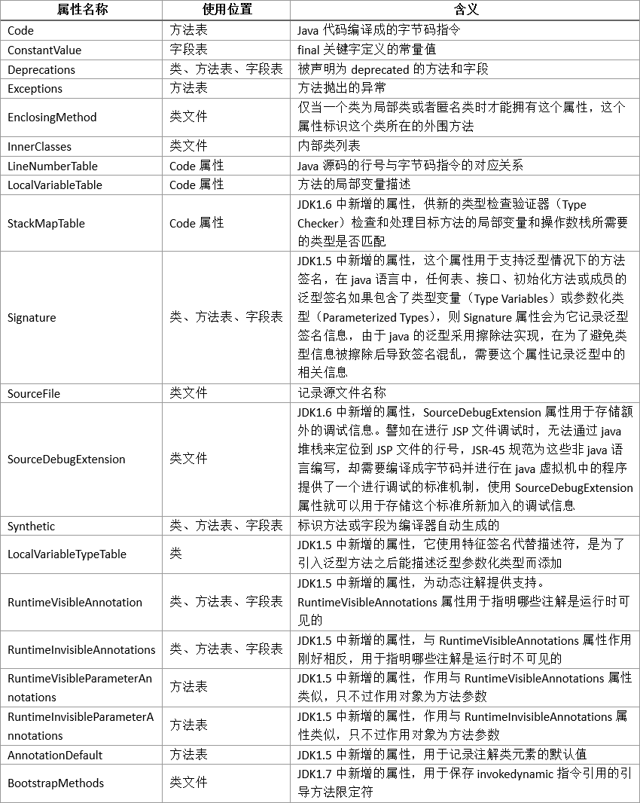
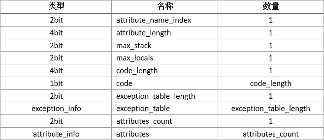

#类文件结构

Java在刚刚诞生之初曾经提出过一个非常著名的口号：“一次编译，导出执行”，将java文件编译为class文件，然后由JVM来处理平台的差异性，这个特性也使其他的语言能够在JVM上运行。

##Class类文件的结构

|占用大小|字段描述|数量|
|---|---|---|
|4bit|magic：魔数，用于标识文件类型，对于java来说是0xCAFEBABE|1|
|2bit|minor_version：次版本号|1|
|2bit|major_version：主版本号|1|
|2bit|constant_pool_count：常量池大小，从1开始而不是0。当这个值为0时，表示后面没有常量|1|
|不定|constant_pool：[#常量池](#常量池)|constant_pool_count-1|
|2bit|access_flags：访问标志，标识这个class是类还是接口、public、abstract、final等|1|
|2bit|this_class：类索引 [#类索引查找全限定名的过程](#类索引查找全限定名的过程)|1|
|2bit|super_class：父类索引|1|
|2bit|interfaces_count：接口计数器|1|
|每个2bit|interfaces：接口索引集合|interfaces_count|
|2bit|fields_count：字段的数量|1|
|不定|fields：[#字段表](#字段表)|fields_count|
|2bit|methods_count：方法数量|1|
|不定|methods：[#方法表](#方法表)|methods_count|
|2bit|attributes_count：属性数量|1|
|不定|attrbutes：[#属性表](#属性表)|attributes_count|

####常量池

主要存放两大类常量：

* **字面量（Literal）**：类似于java的常量
* **符号引用（Symbolic References）**：属于编译原理方面的概念，主要包括类和接口的权限定名（Fully Qualified Name）、字段名称和描述符（Descriptor）、方法名称和描述符。

####类索引查找全限定名的过程

####字段表

字段表集合中不会列出从超类或者父接口中继承而来的字段

* access_flags：**字段标识符**，public、private、protected、static、final、volatile、transient等
* name_index：字段的**简单名称**
* descriptor_index：字段或方法的**描述符**
* attributes_count：属性数量
* attributes：[#属性表](#属性表)

####方法表

####属性表

Class文件、字段表、方法表都可以携带自己的属性表数据集合。与Class文件中其他的数据项目要求严格不同，属性表集合的限制相对宽松。在java虚拟机规范1.7版本中定义了21项属性。

#####1. Code属性

方法体内java代码编译后生成的字节码指令存储在Code属性内，Code属性表的结构：

* attribute_name_index：是一项指向CONSTANT_Utf8_info型常量的索引，常量为“Code”
* attribute_length：属性值的长度
* max_stack：操作数栈（Operand Stacks）深度的最大值
* max_locals：局部变量表所需的存储空间
* code_length：字节码长度
* code：用于存储字节码指令的一系列字节流，每个指令就是一个1bit的单字节  一字节 => 指令 => 动作 （linux命令行、汇编）
* exception_table_length：异常表长度
* exception_table：异常表
  * start_pc：开始行
  * end_pc：结束行
  * handler_pc：处理异常行
  * catch_type：当catch_type类型或其子类型的异常发生时，转到handler_pc

#####2. Exceptions属性

Exceptions属性的作用是列举处方法中可能抛出的受检异常（Checked Exceptions）

* number_of_exceptions：受检异常数
* exception_index_table：是一个指向CONSTANT_Class_info型常量的索引，代表异常类型

#####3. LineNumberTable属性

LineNumberTable属性用于描述java源码行号与字节码号码之间的对应关系。它不是运行时必需的属性，可以不生成。不生成时，抛出异常堆栈中不会显示出错的行号

line_number_table是一个数量为line_number_table_length，类型为line_number_info的集合，line_number_info表包括了start_pc和line_number两个2bit的数据项，前者是字节码行号，后者是java源码行号

#####4. LocalVariableTable属性

LocalVariableTable属性用于描述帧栈中局部变量表中的变量与java源码中定义的变量之间的关系，也不是必需的，可以不生成。不生成时，其他人引用这个方法，所有的参数名称都将会丢失

local_variable_info项目代表了一个栈帧与源码中的局部变量的关联

* start_pc：这个局部变量的生命周期开始的字节码偏移量
* length：作用范围覆盖的长度
* name_index：局部变量名称
* descriptor_index：局部变量的描述符
* index：局部变量在栈帧局部变量表中Slot的位置

#####5. SourceFile属性

SourceFile属性用于记录生成这个Class文件的源码文件名称，也不是必需的，可以不生成。不生成时，抛出异常堆栈中将不会显示出错代码所属的文件名

#####6. ConstantValue属性

ConstantValue属性的作用是通知虚拟机自动为静态变量赋值

#####7. InnerClasses属性

InnerClasses属性用于记录内部类与宿主类之间的关联

#####8. Deprecated及Synthetic属性

这两个属性都是布尔属性。Deprecated代表这个类、字段或方法已经过时，不再推荐使用。Synthetic代表此字段或者方法不是由java源码直接产生的，而是由编译器自行添加的。

#####9. StackMapTable属性

StackMapTable属性会在虚拟机类加载的字节码验证阶段被新类型检查验证器（Type Checker）使用目的在于代替以前比较消耗性能的基于数据流分析的类型推导验证器

#####10. Signature属性

#####11. BootstrapMethods属性

##字节码指令简介

####字节码与数据类型

####加载和存储命令

####运算指令

####类型转换指令

####对象创建与访问指令

####操作数栈管理指令

####控制转移指令

####方法调用和返回指令

####异常处理指令

####同步指令

##公有设计和私有实现

##Class文件结构的发展
