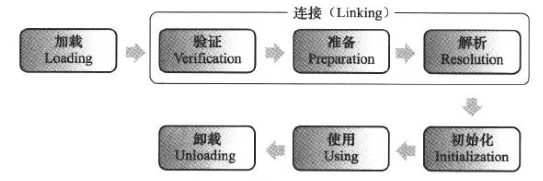

#虚拟机类加载机制

代码编译的结果从本地机械码转变为字节码，是存储格式发展的一小步，却是编程语言发展的一大步

##类加载的时机

类从被加载到虚拟机内存中开始，到卸载出内存为止，它的整个生命周期包括：加载（Loading）、验证（Verificatio）、准备（Preparation）、解析（Resolution）、初始化（Initialization）、使用（Using）和卸载（Unloading）7个阶段

上述阶段通常都是互相交叉地混合式进行的，会在一个阶段执行地过程中调用、激活另一个阶段。下面5种情况必须立即对类进行“初始化”（加载、验证、准备在这之前开始）：

1. 遇到new、getstatic、putstatic或invokestatic这4条字节码指令
2. 使用java.lang.reflect包地方法对类进行反射调用
3. 初始化子类前要先初始化父类（接口不要求其父接口全部完成初始化，只有在使用父接口的时候才会初始化）
4. 虚拟机启动时，需要指定执行地主类（包含main()方法的类）
5. 当使用JDK 1.7的动态语言支持时，如果一个java.lang.invoke.MethodHandle实例最后解析结果REF_getStatic、REF_putStatic、REF_invokeStatic的方法句柄，并且这个句柄所对应的类没有进行过初始化

##类加载的过程

####加载

####验证

####准备

####解析

####初始化

##类加载器

####类与类加载器

####双亲委派机制

####破坏双亲委派机制
